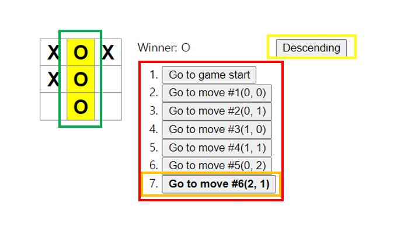

# 튜토리얼

이번에는 리액트 공식 사이트의 튜토리얼의 추가 미션 진행해보도록 하자.

추가 미션의 목록은 아래와 같다.

1. 이동 기록 목록에서 특정 형식(행, 열)으로 각 이동의 위치를 표시.
2. 이동 목록에서 현재 선택된 아이템을 굵게 표시.
3. 사각형을 만들 때 하드코딩 대신에 두 개의 반복문을 사용하도록 Board를 다시 작성.
4. 오름차순이나 내림차순으로 이동을 정력하도록 토글 버튼 추가.
5. 승자가 정해지면 승부의 원인이 된 세 개의 사각형 강조.
6. 승자가 없는 경우 무승부 메시지 표시.

이 미션을 모두 달성한 화면은 아래 사진과 같을 것이다.



빨간 상자는 1번, 주황색은 2번, 노란색은 4번, 초록색은 5번이다.

## 이동 기록 목록에서 특정 형식(행, 열)으로 각 이동의 위치를 표시

이동 기록 목록을 (행, 열) 형식으로 표현해보자. 이를 하기 위해서 나는 Game 컴포넌트에 클릭한 행, 열 정보를 갖는 state를 추가했다.

```javascript
class Game extends React.Component {
  constructor(props) {
    super(props);

    this.state = {
      history: [{
        squares: Array(9).fill(null),
        position: {
          row: null,
          col: null
        }
      }],
    ...
```

<br>

position은 row와 col의 값을 갖는 객체이고, 초기값은 null(처음엔 아무것도 클릭하지 않은 상태이므로)이다.

이제 클릭할 때 이 position 값을 변경해주어야 하므로, handleClick 메서드를 수정해보자.

```javascript
class Game extends React.Component {
    ...

    handleClick(i) {
    const history = this.state.history;
    const current = history[history.length - 1];
    const squares = current.squares.slice();

    ...

    const row = Math.floor(i / 3);
    const col = i % 3;

    this.setState({
      history: history.concat([{
        squares: squares,
        position: {
          row: row,
          col: col
        }
      }]),

      ...

    });
  }
}
```

<br>

일단 row와 col의 값을 매개변수로 받은 i로부터 구했다. row는 i를 3으로 나눈 값이고, col은 i를 3으로 나눈 나머지다. i / 3을 할 때 주의해야 할 점은 JS에서는 정수형, 실수형 구분 없이 모두 실수로 연산 하는 점이다. 나는 Math.floor를 사용해 버림을 해 정수 값으로 구했다.

이후 setState를 통해 state를 업데이트 했다.

이제 행 열 부분을 추가한 버튼을 만들고, 화면에 렌더링 해보자.

```javascript
const moves = history.map((step, move) => {
      const desc = move ?
        'Go to move #' + move + '(' + step.position.row + ', ' + step.position.col + ')':
        'Go to game start';

      ...
```

<br>

현재 단계 뒤에 step.poision.row와 step.position.col을 사용해 행 열을 표시했다.

## 이동 목록에서 현재 선택된 아이템을 굵게 표시

일단 현재 선택된 목록이 무엇인지를 알아야 하기 때문에 나는 Game 컴포넌트에 stepNumber state를 추가했다.

```javascript
class Game extends React.Component {
  constructor(props) {
    super(props);

    this.state = {
      history: [{
        squares: Array(9).fill(null),
        position: {
          row: null,
          col: null
        }
      }],
      stepNumber: 0,
      ...
```

<br>

stepNumber는 현재 단계의 수다. 0부터 시작하고 최대 9까지 갈 수 있다.

이제 버튼을 클릭할 때마다 stepNumber를 증가시켜주기 위해 다시 한번 handleClick 메서드를 수정해보자.

```javascript
handleClick(i) {
    const history = this.state.history;
    const current = history[history.length - 1];
    const squares = current.squares.slice();

    ...

    this.setState({
      history: history.concat([{
        squares: squares,
        position: {
          row: row,
          col: col
        }
      }]),
      stepNumber: history.length,
      xIsNext: !xIsNext,
    });
}
```

<br>

handleClick에서는 stepNumber의 값을 기존 state의 stepNumber의 값에 1을 더한 값을 주어도 되지만, 나는 시간 여행 버튼을 누를 때, state의 history 배열을 splice를 통해 뒷부분을 아예 없애버렸기 때문에 현재 history의 길이를 stepNumber에 주었다.

이제 현재 상태가 stepNumber와 같으면 해당 버튼을 굵게 표시하기 위해서 render의 moves를 수정하자.

```javascript
const moves = history.map((step, move) => {
      ...

      return (
        <li key={move}>
          <button
            className={move === this.state.stepNumber ? 'font-weight-bold' : ''}
            onClick={() => this.jumpTo(move)}>{desc}
          </button>
        </li>
      );
    });
```

move(history 배열의 index)가 stepNumber와 같을 경우 button의 클래스 이름을 font-weight-bold를 주었다. 이제 css에 font-weight-bold 클래스를 bold 처리하는 것만 추가하면 완성이다.

```css
.font-weight-bold {
  font-weight: bold;
}
```

## 사각형을 만들 때 하드코딩 대신에 두 개의 반복문을 사용하도록 Board를 다시 작성

이 부분은 화면으로 차이를 알 수는 없으나, 이후 보드의 크기를 변경시킬 때 유용하게 사용될 수 있다.

Board 컴포넌트를 아래처럼 바꾸면 된다.

```javascript
class Board extends React.Component {
  renderSquare(i) {
    return (
      <Square
        key={i}
        value={this.props.squares[i]}
        onClick={() => this.props.onClick(i)}
      />
    );
  }

  render() {
    const board = [];
    const TABLE_SIZE = 3;

    for (let row = 0; row < TABLE_SIZE; row++) {
      const boardRow = [];
      for (let col = 0; col < TABLE_SIZE; col++) {
        boardRow.push(this.renderSquare(row * 3 + col));
      }
      board.push(
        <div key={row} className="board-row">
          {boardRow}
        </div>
      );
    }

    return <div>{board}</div>;
  }
}
```

여기서 나도 많이 헤맸는데, render 부분을 주목해서 보자.

일단 board 배열을 선언하고, 우리는 3x3 보드 이므로 TABLE_SIZE 상수를 3으로 설정한다. 여기서 for 반복문을 사용해서 Square를 만들고, 한 행씩 만든 값을 board 배열에 추가할 것이다. 한 행씩 만들어야 하기 때문에 row를 도는 for문의 시작 부분에 boardRow 배열을 선언한다. 그리고 col을 돌면서 renderSquare 메서드를 사용해 Square 컴포넌트를 만들고, 이 값을 boardRow에 하나씩 추가한다. col을 전부 돌면 총 3개의 Square 컴포넌트가 boardRow에 들어가 있을 것이다. 이제 이 boardRow를 board-row 클래스 이름을 가진 div로 감싼 후 board에 추가할 건데 `board.push(<div key={row} className="board-row">{boardRow}</div>);` 여기가 중요하다. div 태그를 선언하고, 안에 중괄호로 boardRow를 넣고 div 태그를 닫아서 한 행을 board 배열에 넣는다.

나는 처음에 아래처럼 코딩했다.

```javascript
class Board extends React.Component {
  renderSquare(i) {
    return <Square key={i} value={this.props.squares[i]} onClick={() => this.props.onClick(i)} />;
  }

  render() {
    const board = [];
    const TABLE_SIZE = 3;

    for (let row = 0; row < TABLE_SIZE; row++) {
      let boardRow = <div className="board-row">;
      for (let col = 0; col < TABLE_SIZE; col++) {
        boardRow += renderSquare((row * 3) + col);
      }
      boardRow += </div>

      board.push(boardRow);
    }
    ...
  }
}
```

<br>

이 코드는 boardRow를 선언할 때 div 태그를 닫지 않아서 에러가 발생한다. 그래서 결국 인터넷 검색의 힘을 빌려 위와 같은 구조로 작성해야 한다는 것을 깨달았다.
